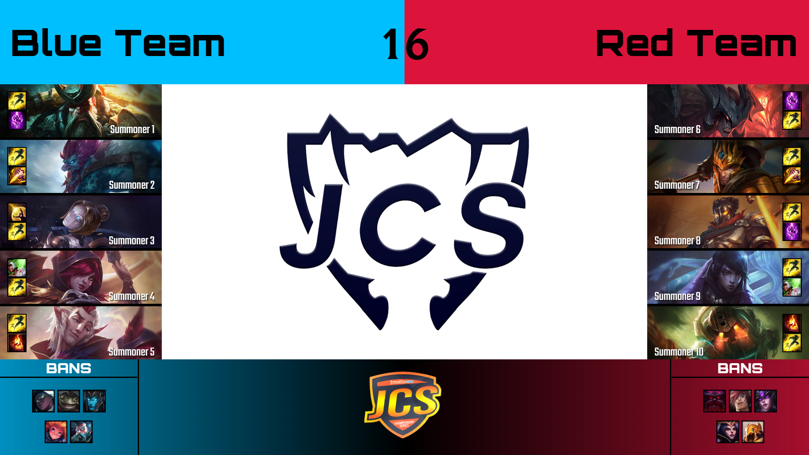

# Overlay
###### An easy-to-use, yet very customizable application to display champion select information in streams

## Requirements
- **Windows**
- Java (min. Java 8)

## Getting started
- Download the latest release [here](https://github.com/piorrro33/overlay/releases/latest). Download the win32 archive for 32 bits Java, or the win64 archive for 64 bits Java.
- Extract the zip file and execute ``run.bat`` to start Overlay.

## Customization
Edit the configuration by modifying ``config.conf`` and saving.
You can also customize fonts and more elements: check out ``./web/img/custom`` and ``./web/fonts``.

## OBS Studio Setup
Two methods can be used to set up Overlay with OBS Studio: simple and advanced.
Please note that the simple method has a resolution restriction (windows cannot exceed a certain size on Windows).
### Method 1 (simple)
1. Open Overlay by double-clicking on `run.bat`.
2. In OBS, set up a window capture of the greenscreen Overlay window.
3. Set up a color key filter with key color set to HTML `#008000` and Similarity/Smoothness to the minimum.
### Method 2 (advanced)
1. Open `config.conf` in a text editor and set `nogui` to `true`. Save the file.
2. Double-click on `run.bat`, wait until you see the message `WebSocket server started successfully` in the console.
3. In OBS, create a new browser source.
4. Check `Local file` and click the `Browse` button. Navigate to the Overlay folder, then select the `web/index.html` file.
5. Set the width and height to a 16:9 aspect ratio (like 1920x1080 for 1080p).
6. Make sure `Shutdown source when not visible` and `Refresh browser when source becomes active` are both **unchecked.**
7. Click OK.
8. Set up a color key filter with key color set to HTML `#008000` and Similarity/Smoothness to the minimum.

Next time, make sure to start Overlay **before** starting OBS Studio. If you forgot, double-click the browser source and click `Refresh cache`.
Don't forget to make your browser source `local file` point to the latest `index.html` after upgrading to a newer Overlay version.

## Building and running
### Building
- Extract ``./libs/lib/win32.zip`` (for 32 bits Java), ``./libs/lib/win64.zip`` (for 64 bits Java) and ``./web/web.zip``.Select "extract here".
- Open the ``scripts`` folder and run ``build_win32.bat`` or ``build_win64.bat``.
### Running
- Execute ``run_win32.bat`` or ``run_win64.bat`` in the ``scripts`` folder.
