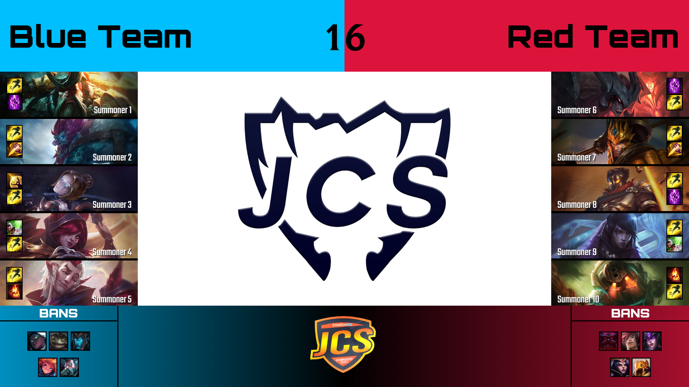

# Overlay
###### A simple program to display champion select information in streams

## Requirements
- **Windows**
- Java (min. Java 8)

## Building
- Extract ``./libs/lib/win32.zip`` (for 32 bits Java), ``./libs/lib/win64.zip`` (for 64 bits Java) and ``./web/web.zip``. Select "extract here".
- Run ``build_win32.bat`` or ``build_win64.bat``

## Running the program
- Execute ``run_win32.bat`` or ``run_win64.bat``

You can edit the configuration by editing ``config.conf`` and restarting the application.